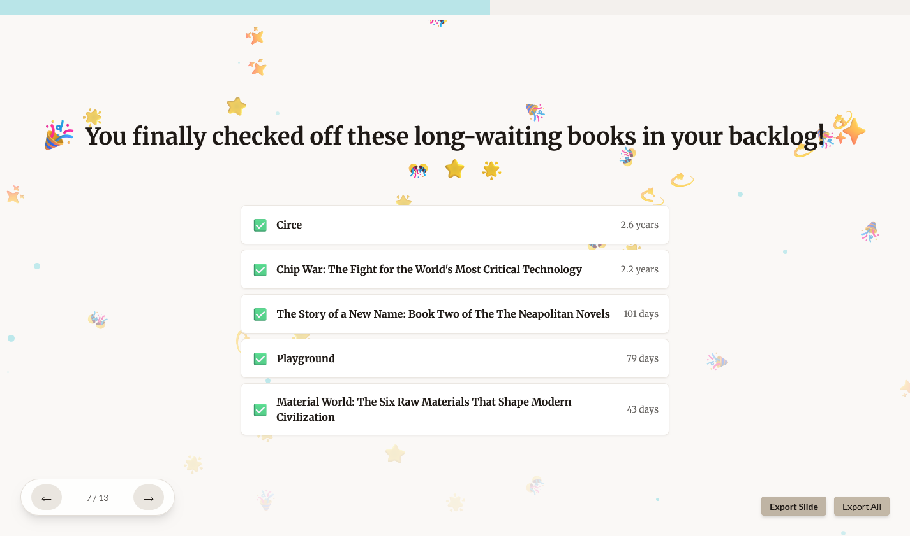

I stumbled on a striking statistic while reading [_The Atlantic_](https://www.theatlantic.com/ideas/2026/01/reading-crisis-solution-literature-personal-passion/685461/)
 the other day. 

> In 2023, fourteen percent of students reported reading for fun *almost every day.* This percentage was 3 percentage points lower than 2020, and 13 percentage points lower than 2012. - [The Nation's Report Card](https://www.nationsreportcard.gov/highlights/ltt/2023/)

The editor Adam Kirsch suggests that campaigns that frame reading as democratic duty are ill-fated to reverse the decline. Instead, if reading is to survive, it must be reintroduced as something pleasurable, perhaps even a bit transgressive. 

People pick up a book for countless reasons. (Some of my personal reasons: to learn about distant worlds, to acquire a new skill, to better understand history and connect with people, and to escape.) Yet, persuading people to take up the habit on any one of these rather diffuse benefits alone is likely insufficient. How do we build a culture where reading feels desirable?

Many proposals I hear aimed at reversing the downward trend is grounded in early childhood education. Start them young, build the habit, hope it sticks, as they say. While important, I wonder whether this kind of framing can unintentionally imply that if you didn’t grow up a reader, you’ve missed your chance. As a relative late-comer to the reading scene—I didn’t start reading for pleasure until I was a sophomore in college—I reject that idea. (In fact, this posture extends beyond reading for me.)

One factor that transformed my relationship to reading as an adult was when it stopped being solitary and started being communal. Reading itself may require retreat and focus, but does it have to be entirely antisocial? There is always the old-fashioned book club. More modern approaches to forming community have emerged through digital and hybrid spaces. Consider the BookTok phenomena where TikTokers review, recommend, and discuss their favorite books in the platform's signature short video format. Last year, I attended a [Reading Rhythms](https://readingrhythms.co/) event, where people gathered simply to read communally, followed by conversation and reflection. And, of course, there is the OG social network for readers: Goodreads.

Inspired by Spotify Wrapped, driven by a belief that gamification can make habits fun rather than obligatory and by the idea that making reading visible can help turn a private habit into a shared one, I built **[Goodreads Wrapped](https://goodreadswrapped.netlify.app/)**, an app that transforms personal reading data into something celebratory and shareable. Goodreads users can export their reading histories ([instructions](https://github.com/aychen5/goodreads_wrapped)), upload a CSV, and receive a personalized "year in reading".

Here it is in action, using my own 2025 reading history!

<video controls preload="metadata" poster="goodreadswrapped_still3.png" width="100%">
  <source src="goodreadswrapped_showcase.mp4" type="video/mp4">
</video>

## Give it a try with your own data [here](https://goodreadswrapped.netlify.app/)!