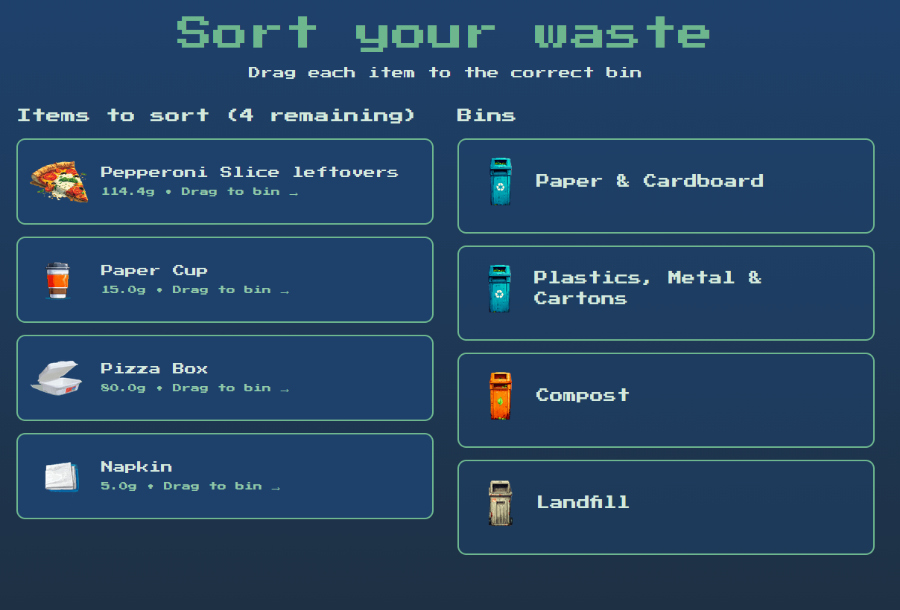
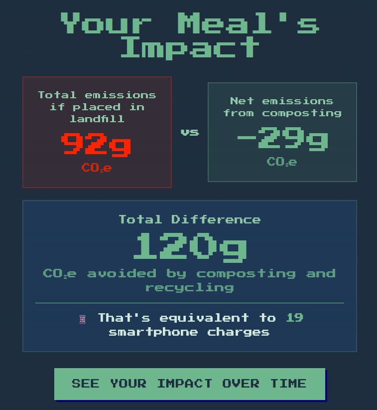
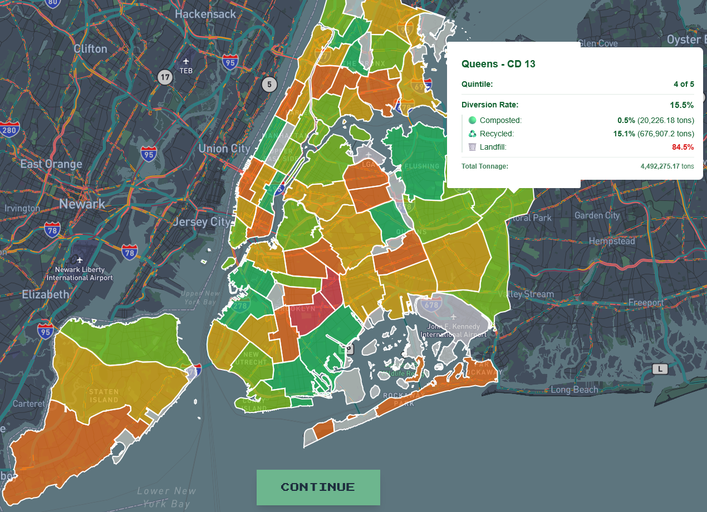

**WasteNotNYC** invites visitors to rethink the full journey of their daily waste — from what’s on their plate to what ends up in the city’s bins. Participants select from a menu of items and are prompted to guess how much can be composted, recycled, or sent to landfill. The system then reveals the correct answers, compares their guesses to others, and projects the environmental impact if those materials were properly sorted over a year. The display then zooms out to a citywide map, visualizing how neighborhoods differ in waste diversion and access to composting, recycling, and reuse programs. Blending playful quizzes, personalized feedback, and civic data storytelling, WasteNotNYC turns the invisible infrastructure of waste management into a shared civic experience. It encourages visitors to see waste not as an endpoint, but as a system of resources, choices, and collective responsibility. 

I was thrilled to share this project at the [NYC PIT Pop-Up](https://nycpitpopup.org/)!

#### Visit the app [here.](https://waste-not-nyc-app.com/)

---

<!--  -->

---
#### Software

  
  
  
  
  

#### Data

<!-- https://data.cityofnewyork.us/City-Government/DSNY-Monthly-Tonnage-Data/ebb7-mvp5/about_data -->

---
## Highlights

--